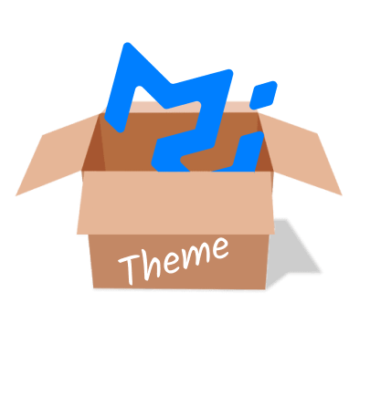
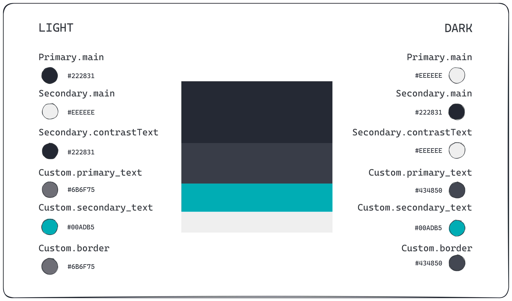
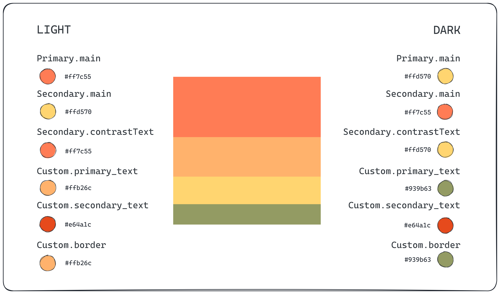

<p align="center">
  <a href="#" rel="noopener" target="_blank"></a>
</p>

<h1 align="center">MUI Theme Pack</h1>

**_Idioma_**

- 🇪🇸 Español
- [🇺🇸 English](https://github.com/wdavidcalsin/mui-theme-pack)

**MUI Theme Pack** Es un paquete que contiene una variedad de temas diseñados para ser utilizados en tus proyectos de Material UI. Además, puedes cambiar fácilmente el modo entre light y dark utilizando el hook proporcionado.
Cada tema ha sido cuidadosamente creado para brindar una apariencia visualmente atractiva y coherente a tu proyecto.
¡Simplifica el diseño de tu proyecto con este conjunto de temas preestablecidos y dale un toque profesional a tu aplicación!

## Instalación

Para instalar el paquete, simplemente ejecuta:

### npm:

```sh
npm install mui-theme-pack
```

### yarn:

```sh
yarn add mui-theme-pack
```

## Uso

### Agregar tema

Para utilizar los temas en tu proyecto, primero debes importar el ThemeContextProvider:

```jsx
import { ThemeContextProvider } from 'mui-theme-pack';
```

Luego, selecciona tu tema de preferencia:

```jsx
import { ThemeContextProvider } from 'mui-theme-pack';
import { FormWithEntries } from './sample';

function App() {
  return (
    <ThemeContextProvider nameTheme="navy-blue">
      <FormWithEntries />
    </ThemeContextProvider>
  );
}

export default App;
```

### Cambiar modo

Cada tema viene con dos modos: claro y oscuro. Puedes cambiar el modo de tu aplicación utilizando el hook useColorMode():

```jsx
import { Stack, TextField, Button } from '@mui/material';
import { useColorMode } from 'mui-theme-pack';

const FormCustom = () => {
  const { mode, toggleColorMode } = useColorMode();

  return (
    <Stack
      direction="column"
      spacing={2}
      sx={{
        paddingY: '2rem',
        paddingX: '3rem',
        bgcolor: 'secondary.main',
      }}
    >
      <TextField label="Your name" />
      <Button onClick={toggleColorMode}>Change Theme: {mode}</Button>
    </Stack>
  );
};
export default FormCustom;
```

## Temas disponibles

El paquete actualmente incluye los siguientes temas:

- **navy-blue**: Es una variante personalizada con colores entre azul oscuro y blanco.

<p align="center">
  <a href="#" rel="noopener" target="_blank"></a>
</p>

- **light-orange**: Es una variante personalizada con colores entre amarillo y naranja.

<p align="center">
  <a href="#" rel="noopener" target="_blank"></a>
</p>

## Contribución

¡Bienvenido a contribuir! Si deseas agregar un nuevo tema, sigue estos pasos:

Crea una nueva rama.
Agrega el nuevo tema en src/themes.
Actualiza el archivo README.md con información sobre el nuevo tema.
Haz un Pull Request.

## Licencia

Este paquete está bajo la Licencia MIT.
